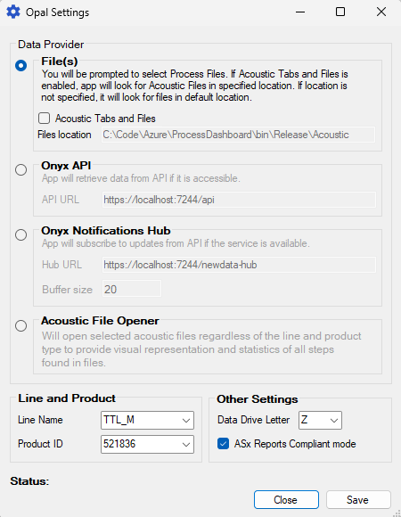
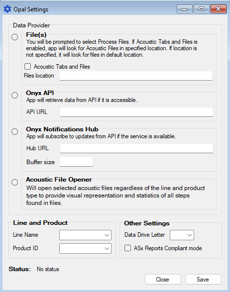
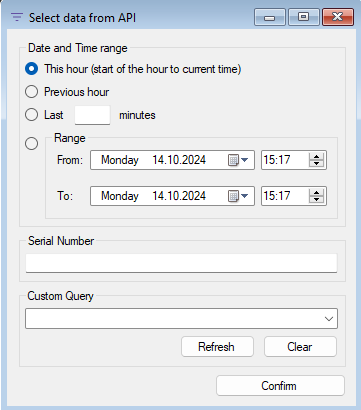

# OPAL

> Insights into production processes.

> Authors:
> 
> Ilya Mudritskiy
> 
> Thomas Lawless

Opal is an end user application for opening, processing, anayzing and representing data from production lines. It can be used as a standalone application to open `.json` files (Process and Acoustic files) and in bundle with [`Onyx`](https://dev.azure.com/sch-ireland/Onyx) service to gather data from database or get a real-time data using SignalR hub.

First Opal was put in production on `TTL` and it provides real-time visual updates for process `ps01` (embossing).

# Installation

**For end users:** 
- Get the latest version of the application and just put the whole folder in a location you find convenient for you.
- **Important:** please, avoid putting the app in any locations that are backed up in OneDrive. It might cause problems.

**For developers**
- You can follow the steps above.
- You can clone the repository and build the application in Visual Studio in Release mode and copy the output files from `...\Opal\bin\Release` to any location you need.

# Configuration

## Configuration file

Configuration is stored in `app-config.json` and it can be edited in any text editor.

File is stored at the same location where `Opal.exe` resides.

## Settings menu in UI

Settings during runtime and in the editor:




1. Each `DataProvider` has its own set of settings and the areas that are not used are disabled.
2. `Save` button also performs extra actions:
   1. `Opyx API` - will send a ping GET HTTP request to a specific endpoint to check if API is reachable and token is valid.
      1. If not reachable - will update `Status` in red color
      2. If token is not valid - will update `Status` in yellow and ask the user to Log in.
   2. `Onyx Notifications Hub`:
      1. Will try to connect to the hub and if successful - disconnect immediately. `Status` will be updated correspondingly.
   3. In any case - will save the configuration to the file.

## Limits

Limits for product's Mean Features and distribution are stored in `Limits` folder in the root location, where `Opal.exe` is located.

# Data Providers

## Files

> In `app-config.json`: 

```json
...
"data_provider": {
    "type": "files",
...
}
```

This Data Provider will open an `OpenFileDialog` window with multiselect enabled and user should select only `.json` **`FILES!`** that contain process data produced by OPC UA client.

- If **Acoustic Tabs** are **enabled** and **Files location is empty**, it will try to find acoustic files on a specified drive (**Data Drive Letter**) automatically.
- If **Acoustic Tabs** are **enabled** and **Files location is not empty**, it will try to find acoustic files in the specified location.
- If **Acoustic Tabs** are **disabled** to acoustic data will be loaded and tabs will not be shown.

Then it will process the data, perform the calculations and populate the corresponding screen with data.

## Onyx API

> In `app-config.json`: 

```json
...
"data_provider": {
    "type": "api",
...
}
```

When you click `Start` with this Data Provider selected, it will open a window where a user can select data from API DB.



User can find data by these parameters:
1. (always used) **Line ID** from `Settings` - should be selected beforehand.
2. (always used) **Type ID** or **Product ID** from `Settings` - should be selected beforehand.
3. Date and Time range - uses the `DUT.created_at` field from the file.
4. Signle DUT by a specific Serial Number.

Custom Query is not available at the moment and planned for the future to be in the form of a `.json` file with a valid MongoDB request that will be sent to Onyx API..

## Notifications Hub

> In `app-config.json`: 

```json
...
"data_provider": {
    "type": "hub",
...
}
```

Application will connect to SignalR Hub with a specific group and listen for any updates from Onyx API. 

Updates are tied to usage of `/api/ProcessData` `POST` request.

Updates are sent only to corresponding group which is formed by Line ID and Product ID (`G-TTL_M-588408`).

Buffer size defines how many Mean Features collections will be stored to plot the distribution on a distribution plot. Best results are achieved using size of `200`.

## Acoustic Opener

> In `app-config.json`: 

```json
...
"data_provider": {
    "type": "acoustic",
...
}
```

Acoustic Opener is a simple screen that reads Acoustic JSON files, scans it for acoustic steps and displays the statistics and plots the data found in file.

## Technical details

There are 2 separate but essential objects in the application: `Screen` and `Data Provider`. They work independently and for both of them the `Factory pattern` is used.

Screen is used via `IScreen` inerface and Data provider is used via `IDataProvider` interface.

In the `App.cs` a data provider is created based on configuration file and in its `IDataProvider.Start()` method a specific IScreen is created and is called and populated via `IScreen.Show()`. Data is put in the screen by calling `IScreen.Update(...)`.

`APIDataProvider.cs`:

```cs
private IScreen _screen;
...
public void Start()
{
    if (_screen == null)
    {
        _screen = ScreenFactory.Create(_config.LineID); // use factory to get specific screen
        _screen.Show(_form.MainFormPanel); // show the basic layout without data
    }

    if (!CheckApiAccess())
        return;

    _uiController.OpenApiDataFilters();

    var data = Task.Run(() => GetData()).GetAwaiter().GetResult();

    _screen.Update(data, _form); // load data to the screen, process it and display
}
```

# Main terms

- `Opal`: Codename for this project, Process Dashboard was omitted because this name gave the wrong idea of app purpuse.
- `Screen`: An object of `Control` type that is inserted in `Panel` in `MainForm`. A visual representation for a specific line or purpose.
- `Data Provider`: A class that is responsible for acquiring and processing the data before providing the resulting data to the screen.
- `Tab`: Applicable to `TTLScreen`. `Tab` from `TabControl`, i.e. **Temperature**, **Pressure**, **FR**, **THD**, etc.
- `Hub`: `SignalR` hub that is implemented in **Onyx** and to which Opal can connect using corresponding Data Provider. 
- `Plot`: `ScottPlot` `Plot` object canvas that can plot different styles of graphs and plots.
- `Curve`: Usually any type of **ScatterPlot**.
- `Table`: Tabular data, usually references the **Features** tables.
- `Distribution`: Bar graphs that show the number of values in specific buckets over some parameter (time, temperature, pressure)
- `Data Point`: A (**x** - time, **y** - presure or temperature) point of some event during the process, like HeaterOff, CoolingOn, etc.
- `Feature`: Calculated parameter using DataPoints that shows (usually difference) between said DataPoints and representing a charachteristic of the process, i.e. HRc is Heater Runtime Calculated and is calculated as t4 - t2 or HeaterOff - HeaterOn. 
- `Mean Feature`: Mean value of multiple features, if several files were selected. Acts as current **Feature** if 1 unit of data was opened for 1 Die-side.
- `Data Viewer`: Additional form that shows all calculated **Features** and **Data Points** in a big table along with serial numbers.
- `Limits`: Limits for a specific product's features (i.e. 576661). used in tables as min and max columns and as red vertical lines on distribution plots with the same idea.


# Configuration file

`app-config.json`:

```json
{
  "product_id": "521836",
  "line_id": "TTL_M",
  "data_drive_letter": "Z",
  "asx_compliant_mode": true,
  "enabled": true,
  "hub_distribution_buffer": 20,

  "acoustic": {
    "enabled": false,
    "files_custom_location": "C:\\Code\\Azure\\ProcessDashboard\\bin\\Release\\Acoustic"
  },
  "auth": {
    "token": "abeC93d..."
  },
  "data_provider": {
    "type": "hub",
    "api_url": "https://localhost:7244/api",
    "hub_url": "https://localhost:7244/newdata-hub"
  },

  "line_product_map": {
    "TTL_M": [
      "588408",
      "521836",
      "576661"
    ],
    "MDA": [
      "999999"
    ]
  }
}
```

## Configuration overview

```json
"product_id": "521836",
"line_id": "TTL_M",
"data_drive_letter": "Z",
"asx_compliant_mode": true,
"enabled": true,
"hub_distribution_buffer": 20,
```

- `product_id`: ID of the product currently running on the production line. Can be changed in Settings.
- `line_id`: Name of the production line from OPC JSON files and data.
- `data_drive_letter` (only in OT network): the letter of the network drive (usually BigData drive) that stores Acoustic files from ASx.
- `asx_compliant_mode`: 
  - `true`: Opal will open Acoustic files as if they were produced by ASx.
  - `false`: Opal will open Acoustic files as if they were produced by Klippel testing system.
- `enabled`: Lock the settings so they can not be changed (disables all controls). Double click on label `Status` in Settings will toggle this parameter.
- `hub_distribution_buffer`: Amount of features to keep in buffer when Opal is using Hub data provider. Those accumulated features will be shown on distribution plots.

---

```json
"acoustic": {
    "enabled": false,
    "files_custom_location": "C:\\Code\\Azure\\ProcessDashboard\\bin\\Release\\Acoustic"
}
```

- `acoustic`: area for acoustic data abd tabs settings.
  - `enabled`:
    - `true`: When loading process data application will try to find and load acoustic data using the serial numbers from process data and create tabs with acoustic data plotted.
    - `false`: Will skip the step of locating and loading acoustic data. Tab will not be created.
  - `files_custom_location`: Full path to the folder where `.json` files with acoustic data can be found.
    - `C:\\...` (non-empty string): Will automatically go to the specified location and try to find corresponding acoustic data.
    - `empty string`: Will open a dialog where you can select the files you want to load (will open only files with matching serial numbers).

---

```json
"auth": {
    "token": "abeC93d..."
}
```

- `auth`: Area for Onyx API authentication and authorization data.
  - `token`: API JWT token to access the API. If not present, in settings you will be prompted to Log in to API and Opal will acquire the token.

---

```json
"data_provider": {
    "type": "hub",
    "api_url": "https://localhost:7244/api",
    "hub_url": "https://localhost:7244/newdata-hub"
}
```

- `data_provider`: Defines how Opal will try to get the data. 
  - `type`: Type of source or the class that will gather and pre-process the data for application.
    - `files`: Opens a dialog where user can select process files. If Acoustic is enabled above, also will load acoustic files and create acoustic tabs.
    - `api` (requires **Onyx**): Will open a new form with API data selector where user can select data based on date and time, serial number, etc. **Important**: selected Line ID and Product ID will affect the search - request to API will return only data about selected product from selected line.
    - `hub` (requires **Onyx**): Will use SignalR Hub to get updates from Onyx when endpoint `/api/ProcessData` with `[POST]` request will be used.
    - `acoustic`: Will open a dialog where user must select acoustic files generated by ASx and will open them in a special screen where all discovered acoustic steps can be seled and visualised.
  - `api_url`: base URL where Onyx API can be found. `/api/ProcessData` and other postfixes are appended automatically.
  - `hub_url`: base URL where SignalR hub in Onyx can be found.

---
```json
"line_product_map": {
    "TTL_M": [
        "588408",
        "521836",
        "576661"
    ],
    "MDA": [
        "999999"
    ]
}
```

- `line_product_map`: a map where key is Line ID and value is a list of Product IDs that are produced on the specific line. This data is used in Settings.

## Limits

Opal supports product limits from version `V1.8.5`. They are stored in the `.json` files in the 
- `<Opal.exe path>/Limits/<ProductID>.json`

Additional fields or limits can be added, for example limits for curves (Temperature and Pressure). 

Here is an example of the limits (file `581940.json`):

```json
{
  "typeid": "581940",
  "mean_limits": {
    "HR": {
      "min": 7.446,
      "max": 9.622
    },
    "HRC": {
      "min": 7.413,
      "max": 9.618
    },
    ...
    ...
    ...
    "PressDiff3": {
      "min": 0.883,
      "max": 19.172
    },
    "PressDiff4": {
      "min": 0.118,
      "max": 14.654
    }
  }
}
```

These limits are used in Process tabs (Temperature and Pressure) in tables with Mean Features. If limits file was found, tables will have 4 columns: **Name**, **Min**, **Value**, **Max** and if any of the limits was broken - name of the mean feature and limit value will be colored red. If not, tables will ahve only 2 columns: **Name**, **Value**.

`mean_limits` are limits for mean features. Thay are displayed in tables and on distribution plots as red vertical lines.

# Further development and improvements

## New features

- Data Viewer for all Data Providers
- Implement "yellow" limits with 1 sigma variation. If the highest bar on distribution plot crosses the yellow limit, process is not optimal and engineers and technicians should take actions to make the process optimal again.
- Screen should be automatically reloaded when data with new Type ID came from Hub Provider. Along with it Limits should be loaded (if exist).

## Possible full rework

- Simplify or optimize calculations
- Transfer calculations to Onyx (performance should be in priority) and make Opal only as presentation and file opener tool. (will require Onyx infrastructure rework)
- Move from WinForms to Web using JS and frameworks